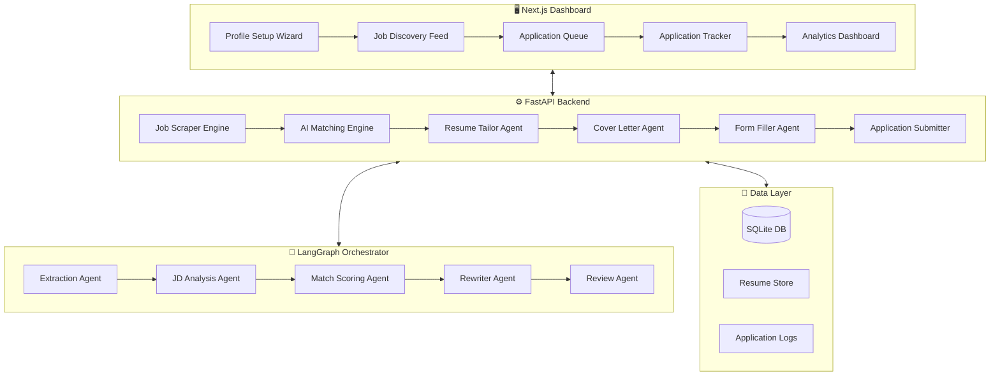

# 🚀 AI Auto Applier — Autonomous Job Application System

An AI-powered system that automatically discovers, matches, tailors, and applies to jobs on your behalf across multiple platforms.

## Background & Goals

You want a system that can:
1. **Scrape** job listings from multiple platforms (LinkedIn, Indeed, Glassdoor, Naukri, etc.)
2. **Match** jobs against your profile (AI Engineer, AI Full Stack Engineer, ML Engineer)
3. **Tailor** your resume per JD — rewriting bullet points, highlighting relevant projects
4. **Generate** personalized cover letters and messages per role
5. **Auto-apply** by filling out forms, uploading documents, and submitting
6. **Track** all applications in a centralized dashboard

---

## User Review Required

> [!IMPORTANT]
> **API Keys Required**: This system needs API keys for LLM providers (OpenAI/Gemini/Anthropic). Which LLM provider do you prefer? I'll default to **Google Gemini** (free tier available) but can support others.

> [!WARNING]  
> **Platform ToS Risk**: Automating applications on LinkedIn, Indeed, etc. can violate their Terms of Service. The system will implement rate-limiting, human-like delays, and a **human-in-the-loop approval step** before each submission. You can toggle between "full auto" and "approval required" modes.

> [!IMPORTANT]
> **Resume Input**: You'll need to provide your master resume (PDF/DOCX), a list of projects with descriptions, and your target job preferences. I'll create a setup wizard for this.

## Open Questions

1. **LLM Provider**: Which AI provider do you want to use? Options:
   - Google Gemini (recommended — free tier, great quality)
   - OpenAI GPT-4o
   - Anthropic Claude
   - Local (Ollama with Llama 3)
   
2. **Target Platforms**: Which job platforms should we prioritize?
   - LinkedIn Jobs
   - Indeed
   - Glassdoor
   - Naukri (India-specific)
   - Wellfound (startups)
   - Company career pages
   
3. **Approval Mode**: Do you want:
   - **Semi-auto** (AI prepares everything, you click "Apply" to confirm) — *recommended*
   - **Full auto** (AI applies without asking — risky but fast)

4. **Deployment**: Should this run as:
   - A local desktop app (Electron + Python backend)
   - A web app you access from any browser
   - A CLI tool

---

## Architecture Overview



---

## Tech Stack

| Layer | Technology | Why |
|-------|-----------|-----|
| **Frontend** | Next.js 14 + React | Premium UI, SSR, great DX |
| **Styling** | Vanilla CSS with design tokens | Full control, no dependencies |
| **Backend** | Python FastAPI | Async, fast, great for AI/ML |
| **AI Orchestration** | LangGraph | Stateful multi-agent workflows |
| **LLM** | Google Gemini API | Free tier, high quality |
| **Browser Automation** | Playwright (Python) | Modern, fast, reliable |
| **Database** | SQLite + SQLAlchemy | Zero config, portable |
| **Resume Parsing** | PyMuPDF + python-docx | Extract text from PDF/DOCX |
| **Job Scraping** | httpx + BeautifulSoup | Lightweight, fast |
| **Task Queue** | APScheduler | Background job scheduling |

---

## Proposed Changes

### Phase 1: Project Foundation & Data Layer

#### [NEW] `backend/` — Python Backend Structure

```
d:/AI Auto applier/
├── backend/
│   ├── main.py                    # FastAPI app entry
│   ├── requirements.txt           # Python dependencies
│   ├── config.py                  # Settings & env vars
│   ├── database/
│   │   ├── __init__.py
│   │   ├── models.py              # SQLAlchemy models
│   │   ├── database.py            # DB connection & session
│   │   └── migrations.py          # Auto-migration helper
│   ├── api/
│   │   ├── __init__.py
│   │   ├── profile.py             # Profile CRUD endpoints
│   │   ├── jobs.py                # Job discovery endpoints
│   │   ├── applications.py        # Application tracking endpoints
│   │   └── settings.py            # User settings endpoints
│   ├── agents/
│   │   ├── __init__.py
│   │   ├── orchestrator.py        # LangGraph main workflow
│   │   ├── jd_analyzer.py         # JD parsing & analysis agent
│   │   ├── resume_tailor.py       # Resume rewriting agent
│   │   ├── cover_letter.py        # Cover letter generation agent
│   │   └── match_scorer.py        # Job-profile matching agent
│   ├── scrapers/
│   │   ├── __init__.py
│   │   ├── base_scraper.py        # Abstract scraper interface
│   │   ├── linkedin_scraper.py    # LinkedIn job scraper
│   │   ├── indeed_scraper.py      # Indeed job scraper
│   │   ├── naukri_scraper.py      # Naukri job scraper
│   │   └── generic_scraper.py     # Generic career page scraper
│   ├── automation/
│   │   ├── __init__.py
│   │   ├── form_filler.py         # Intelligent form filling
│   │   ├── browser_manager.py     # Playwright browser lifecycle
│   │   └── platform_handlers/
│   │       ├── linkedin_handler.py
│   │       ├── indeed_handler.py
│   │       └── naukri_handler.py
│   ├── services/
│   │   ├── __init__.py
│   │   ├── resume_parser.py       # PDF/DOCX → structured data
│   │   ├── resume_generator.py    # Generate tailored PDF
│   │   ├── scheduler.py           # Background job scheduling
│   │   └── notifications.py       # Status notifications
│   └── utils/
│       ├── __init__.py
│       ├── llm_client.py          # LLM provider abstraction
│       └── helpers.py             # Common utilities
```

**Key Models (database/models.py):**
- `UserProfile` — name, email, phone, skills, experience, education, projects
- `MasterResume` — stored resume text + file path
- `Project` — individual project entries with descriptions
- `JobListing` — scraped job data (title, company, JD, URL, platform, status)
- `Application` — tracking (job_id, status, tailored_resume, cover_letter, applied_at)
- `ApplicationLog` — detailed action logs per application

---

### Phase 2: AI Agent Pipeline (LangGraph)

#### [NEW] `backend/agents/orchestrator.py`

The core LangGraph workflow that processes each job application:

```
┌──────────────┐     ┌──────────────┐     ┌──────────────┐
│  Parse JD    │────▶│  Score Match  │────▶│  Filter      │
│  (Extract    │     │  (Semantic    │     │  (Skip if    │
│   keywords)  │     │   similarity) │     │   score<60%) │
└──────────────┘     └──────────────┘     └──────┬───────┘
                                                  │
                                                  ▼ (score ≥ 60%)
┌──────────────┐     ┌──────────────┐     ┌──────────────┐
│  Submit /    │◀────│  Generate    │◀────│  Tailor      │
│  Queue for   │     │  Cover       │     │  Resume      │
│  Approval    │     │  Letter      │     │  (Rewrite)   │
└──────────────┘     └──────────────┘     └──────────────┘
```

**State Schema:**
```python
class ApplicationState(TypedDict):
    user_profile: dict           # Parsed user profile
    job_listing: dict            # Current job data
    jd_analysis: dict            # Extracted requirements
    match_score: float           # 0-100 compatibility score
    matched_skills: list         # Skills that match
    gap_skills: list             # Skills to address
    tailored_resume: str         # Modified resume text
    tailored_resume_pdf: bytes   # Generated PDF
    cover_letter: str            # Personalized cover letter
    application_status: str      # pending/approved/submitted/failed
    action_log: list             # Step-by-step log
```

---

### Phase 3: Job Scraping Engine

#### [NEW] `backend/scrapers/`

Each scraper implements a common interface:
```python
class BaseScraper(ABC):
    async def search(self, query: str, location: str, filters: dict) -> list[JobListing]
    async def get_job_details(self, job_url: str) -> JobDetails
    async def is_active(self, job_url: str) -> bool
```

**Scraping Strategy:**
- Use **httpx** for API-based scraping where possible (Indeed, LinkedIn public API)
- Use **Playwright** for JavaScript-heavy sites
- Implement **smart rate limiting** (random delays 2-8s between requests)
- **Dedup** jobs by URL + title hash to avoid re-processing
- **Freshness check** to skip expired/ghost listings
- Run on a configurable schedule (e.g., every 6 hours)

---

### Phase 4: Browser Automation (Apply Engine)

#### [NEW] `backend/automation/`

The form filler uses AI to understand and fill arbitrary application forms:

1. **Page Analysis**: Playwright captures the DOM → LLM identifies form fields
2. **Smart Mapping**: Maps user profile data to form fields
3. **File Upload**: Uploads tailored resume PDF
4. **Multi-step Forms**: Handles paginated application flows
5. **Verification**: Screenshots each step for audit trail

**Platform-specific handlers** for known sites (LinkedIn Easy Apply, Indeed Apply, Naukri Apply) with fallback to the generic AI form filler.

---

### Phase 5: Frontend Dashboard

#### [NEW] `frontend/` — Next.js Application

```
d:/AI Auto applier/
├── frontend/
│   ├── package.json
│   ├── next.config.js
│   ├── app/
│   │   ├── layout.js              # Root layout with nav
│   │   ├── page.js                # Dashboard home
│   │   ├── globals.css            # Design system
│   │   ├── profile/
│   │   │   └── page.js            # Profile setup wizard
│   │   ├── jobs/
│   │   │   └── page.js            # Job discovery feed
│   │   ├── applications/
│   │   │   └── page.js            # Application tracker
│   │   ├── queue/
│   │   │   └── page.js            # Pending approvals
│   │   └── analytics/
│   │       └── page.js            # Stats & insights
│   ├── components/
│   │   ├── Sidebar.js
│   │   ├── JobCard.js
│   │   ├── ApplicationTimeline.js
│   │   ├── ResumePreview.js
│   │   ├── MatchScore.js
│   │   └── StatsCard.js
│   └── lib/
│       └── api.js                 # Backend API client
```

**Dashboard Pages:**

| Page | Purpose |
|------|---------|
| **Dashboard** | Overview stats — jobs found, applied, interviews, match rates |
| **Profile Setup** | Upload resume, add projects, set preferences (roles, locations, salary) |
| **Job Feed** | Live feed of matched jobs with match scores, one-click approve |
| **Application Queue** | Pending applications with tailored resume preview + cover letter |
| **Application Tracker** | Status of all applications (Applied, Viewed, Rejected, Interview) |
| **Analytics** | Charts — applications/day, response rates, top companies |

**Design:**
- Dark theme with glassmorphism cards
- Vibrant accent colors (cyan/purple gradient)
- Smooth micro-animations
- Responsive layout
- Real-time status updates via WebSocket

---

### Phase 6: Integration & Polish

#### [MODIFY] Tying it all together

- WebSocket connection for real-time updates (job found → matched → applied)
- Background scheduler for periodic job scraping
- Notification system (in-app + optional email)
- Export functionality (CSV of all applications)
- Settings page (API keys, preferences, rate limits)

---

## Verification Plan

### Automated Tests
1. **Unit tests** for each AI agent (mocked LLM responses)
2. **Integration tests** for the scraper → matcher → tailor pipeline
3. **E2E test** using a mock job application form
4. Run: `pytest backend/tests/ -v`

### Manual Verification
1. **Profile Setup**: Upload a real resume, verify parsing
2. **Job Discovery**: Run scraper, verify relevant jobs found
3. **Resume Tailoring**: Compare original vs tailored resume for a sample JD
4. **Form Filling**: Test on a real job application page (in approval mode)
5. **Dashboard**: Visual inspection of all pages

### Browser Testing
- Launch the dashboard and verify all pages render correctly
- Test the application flow end-to-end in approval mode

---

## Implementation Order

| Phase | Deliverable | Estimated Effort |
|-------|------------|-----------------|
| **1** | Project setup, DB models, FastAPI skeleton | Foundation |
| **2** | AI agents (JD analyzer, resume tailor, cover letter) | Core AI |
| **3** | Job scrapers (LinkedIn, Indeed, Naukri) | Data pipeline |
| **4** | Browser automation (form filler, platform handlers) | Automation |
| **5** | Next.js dashboard (all pages) | Frontend |
| **6** | Integration, WebSocket, scheduler, polish | Integration |

> [!TIP]
> I recommend building this incrementally — starting with the backend AI pipeline (Phases 1-2), then adding scrapers and automation (3-4), and finally the premium dashboard (5-6). This way you can start testing the AI quality early.
